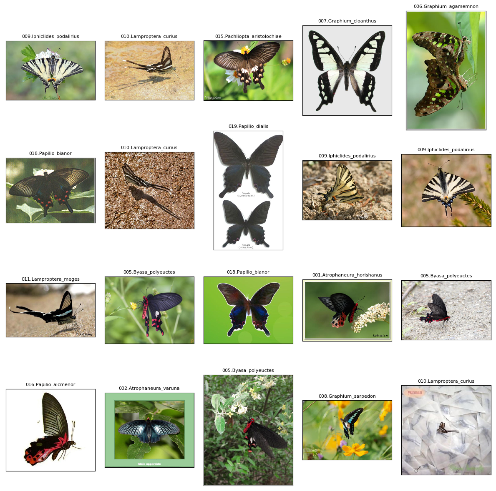
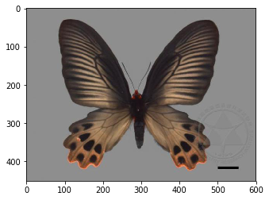
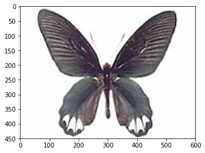
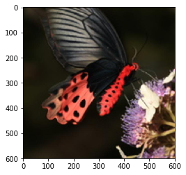
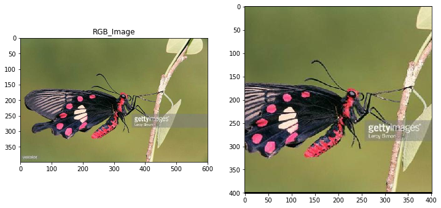
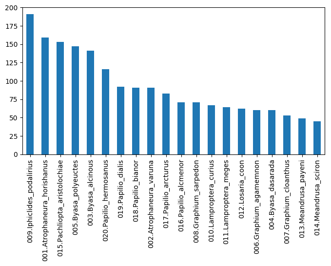
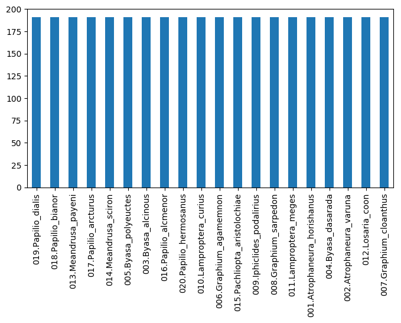
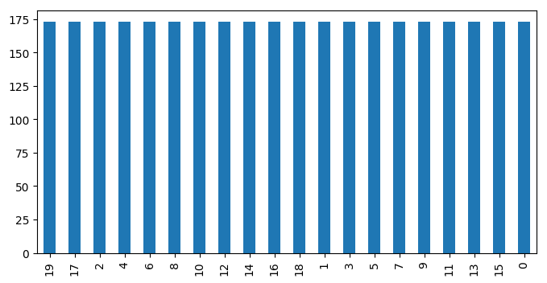
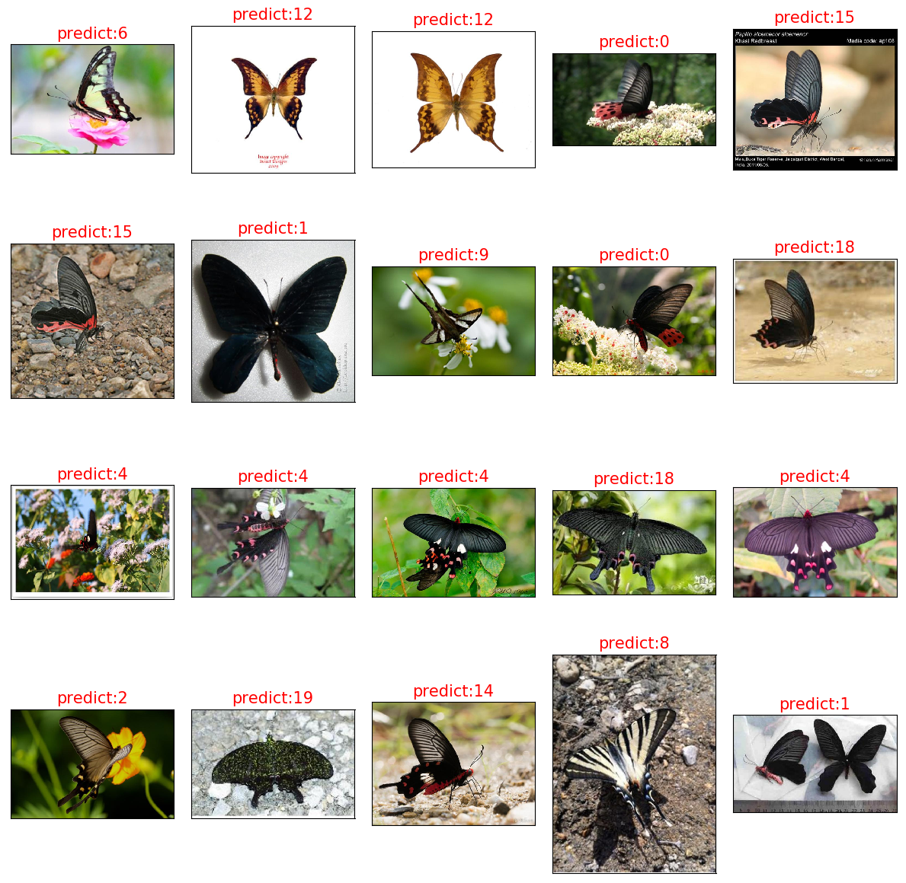

```python
# !cd data/data73997 &&\
# !unzip -qo data/Butterfly20.zip
# !unzip -qo data/Butterfly20_test.zip
```

    /bin/sh: 1: !unzip: not found
    unzip:  cannot find or open data/Butterfly20_test.zip, data/Butterfly20_test.zip.zip or data/Butterfly20_test.zip.ZIP.


# 基于PaddlePaddle2.0的蝴蝶图像识别分类——利用预训练残差网络ResNet50模型

## 1. 蝴蝶识别分类任务概述

人工智能技术的应用领域日趋广泛，新的智能应用层出不穷。本项目将利用人工智能技术来对蝴蝶图像进行分类，需要能对蝴蝶的类别、属性进行细粒度的识别分类。相关研究工作者能够根据采集到的蝴蝶图片，快速识别图中蝴蝶的种类。期望能够有助于提升蝴蝶识别工作的效率和精度。


## 2. 创建项目和挂载数据

数据集都来源于网络公开数据（和鲸社区）。图片中所涉及的蝴蝶总共有9个属，20个物种，文件genus.txt中描述了9个属名，species.txt描述了20个物种名。

在创建项目时，可以为该项目挂载Butterfly20蝴蝶数据集，即便项目重启，该挂载的数据集也不会被自动清除。具体方法如下：首先采用notebook方式构建项目，项目创建框中的最下方有个数据集选项，选择“+添加数据集”。然后，弹出搜索框，在关键词栏目输入“bufferfly20”，便能够查询到该数据集。最后，选中该数据集，可以自动在项目中挂载该数据集了。

需要注意的是，每次重新打开该项目，data文件夹下除了挂载的数据集，其他文件都将被删除。

被挂载的数据集会自动出现在data目录之下，通常是压缩包的形式。在data/data63004目录，其中有两个压缩文件，分别是Butterfly20.zip和Butterfly20_test.zip。也可以利用下载功能把数据集下载到本地进行训练。


## 3. 初探蝴蝶数据集

我们看看蝴蝶图像数据长什么样子？

首先，解压缩数据。类以下几个步骤：

第一步，把当前路径转换到data目录，可以使用命令!cd data。在AI studio nootbook中可以使用Linux命令，需要在命令的最前面加上英文的感叹号(!)。用&&可以连接两个命令。用\号可以换行写代码。需要注意的是，每次重新打开该项目，data文件夹下除了挂载的数据集，其他文件都会被清空。因此，如果把数据保存在data目录中，每次重新启动项目时，都需要解压缩一下。如果想省事持久化保存，可以把数据保存在work目录下。

实际上，!加某命令的模式，等价于python中的get_ipython().system('某命令')模式。

第二步，利用unzip命令，把压缩包解压到当前路径。unzip的-q参数代表执行时不显示任何信息。unzip的-o参数代表不必先询问用户，unzip执行后覆盖原有的文件。两个参数合起来，可以写为-qo。


```python
!cd data/data73997  &&\
unzip -qo Butterfly20_test.zip &&\
unzip -qo Butterfly20.zip &&\
rm -r __MACOSX
```

### 3.1 导入相关库文件


```python
import paddle
import matplotlib.pyplot as plt
import PIL.Image as Image
import numpy as np
import matplotlib.pyplot as plt 
import cv2
import os 
import glob
import random
import time
import pandas as pd


print(f'Welcome to paddle  {paddle.__version__} zoo,\n there are many butterflies here today,\n please enjoy the good time with us!' )
```

    Welcome to paddle  2.0.2 zoo,
     there are many butterflies here today,
     please enjoy the good time with us!


```python
# but_files = np.array(glob("/data/images/*/*/*"))
# print number of images in each dataset
# print('There are %d total dog images.' % len(but_files))
data_path='/home/aistudio/data/data73997/Butterfly20/*/*.jpg'
test_path='/home/aistudio/data/data73997/Butterfly20_test/*.jpg'
but_files =glob.glob(data_path)
test_files =glob.glob(test_path)


print(f'训练集样品数量为：{len(but_files)}个\n 测试集样品数量为：{len(test_files)}个')
```

    训练集样品数量为：1866个
     测试集样品数量为：200个


### 欣赏一下各类的蝴蝶
每次运行均会随机产生不同的蝴蝶图片


```python
index=random.choice(but_files)
index20 =random.sample(but_files,20)
plt.figure(figsize=(12,12),dpi=100)
for i in range(20):
    img = Image.open(index20[i])
    name=index20[i].split('/')[-2]
    plt.subplot(4, 5, i + 1)
    plt.imshow(img, 'gray')
    plt.title(name, fontsize=8)
    plt.xticks([]), plt.yticks([])
plt.tight_layout()
```

    /opt/conda/envs/python35-paddle120-env/lib/python3.7/site-packages/matplotlib/cbook/__init__.py:2349: DeprecationWarning: Using or importing the ABCs from 'collections' instead of from 'collections.abc' is deprecated, and in 3.8 it will stop working
      if isinstance(obj, collections.Iterator):
    /opt/conda/envs/python35-paddle120-env/lib/python3.7/site-packages/matplotlib/cbook/__init__.py:2366: DeprecationWarning: Using or importing the ABCs from 'collections' instead of from 'collections.abc' is deprecated, and in 3.8 it will stop working
      return list(data) if isinstance(data, collections.MappingView) else data





#### 随机查看一个类别

Butterfly20文件夹中有很多子文件夹，每个子文件夹下又有很多图片，每个子文件夹的名字都是蝴蝶属种的名字。由此，可以推测每个文件夹下是样本，而样本的标签就是子文件夹的名字。

我们绘制data/Butterfly20/001.Atrophaneura_horishanus文件夹下的图片006.jpg。根据百度百科，Atrophaneura horishanus是凤蝶科、曙凤蝶属的一个物种。

我们再绘制data/Butterfly20/002.Atrophaneura_varuna文件夹下的图片006.jpg。根据百度百科，Atrophaneura varuna对应的中文名称是“瓦曙凤蝶”，它是凤蝶科、曙凤蝶属的另一个物种。

虽然乍一看蝴蝶都是相似的，但不同属种的蝴蝶在形状、颜色等细节方面还是存在很大的差别。


```python
import matplotlib.pyplot as plt
import PIL.Image as Image

path='/home/aistudio/data/data73997/Butterfly20/001.Atrophaneura_horishanus/006.jpg'
img = Image.open(path)
plt.imshow(img)          #根据数组绘制图像
plt.show()               #显示图像
```





```python
path='/home/aistudio/data/data73997/Butterfly20/002.Atrophaneura_varuna/006.jpg'
img = Image.open(path)
plt.imshow(img)          #根据数组绘制图像
plt.show()               #显示图像
```





更具挑战的是，即便属于同一属种，不同的蝴蝶图片在角度、明暗、背景、姿态、颜色等方面均存在不小差别。甚至有的图片里面有多只蝴蝶。以下两张蝴蝶图片均出自同一个属种Atrophaneura horishanus。


```python
path1='/home/aistudio/data/data73997/Butterfly20/001.Atrophaneura_horishanus/006.jpg'
path2='/home/aistudio/data/data73997/Butterfly20/001.Atrophaneura_horishanus/100.jpg'


img1 = Image.open(path1)
plt.imshow(img1)          #根据数组绘制图像
plt.show()

img2 = Image.open(path2)
plt.imshow(img2)          #根据数组绘制图像
plt.show()               #显示图像
```





### 仿射填充+中心裁切增广技术,可以避免resize造成的变形


```python
def enlarge(img): 
    h,w,_=img.shape
    ty=(600-h)//2
    tx=(600-w)//2
    # 定义平移矩阵，需要是numpy的float32类型
    # x轴平移200，y轴平移500
    M = np.float32([[1, 0, tx], [0, 1, ty]])
    # 用仿射变换实现平移
    dst = cv2.warpAffine(img, M, (600, 600))
    dst = dst[100:501,100:501,:]
    return dst
    
index=random.choice(but_files)
#index=but_files[1]
print(index)
name=index.split('/')[-2]
img = Image.open(index)
img =cv2.imread(index)
print(img.shape)
img =img[:,:,::-1]
imgl=enlarge(img)
print(imgl.shape)
print(f'该样本标签为:{name}')
# plt.figure(figsize=(8,10),dpi=50)
# plt.axis('off')
# plt.imshow(img)   
plt.figure(figsize=(12,12))
#显示各通道信息
plt.subplot(121)
plt.imshow(img,'gray')
plt.title('RGB_Image')
plt.subplot(122)
plt.imshow(imgl,'gray')
```

    /home/aistudio/data/data73997/Butterfly20/015.Pachliopta_aristolochiae/132.jpg
    (398, 600, 3)
    (401, 401, 3)
    该样本标签为:015.Pachliopta_aristolochiae


    <matplotlib.image.AxesImage at 0x7f2dba677f10>





## 4. 准备数据

数据准备过程包括以下两个重点步骤：

一是建立样本数据读取路径与样本标签之间的关系。

二是构造读取器与数据预处理。可以写个自定义数据读取器，它继承于PaddlePaddle2.0的dataset类，在__getitem__方法中把自定义的预处理方法加载进去。


```python
# 以下代码用于建立样本数据读取路径与样本标签之间的关系
import os
import random

data_list = [] # 用个列表保存每个样本的读取路径、标签

# 由于属种名称本身是字符串，而输入模型的是数字。需要构造一个字典，把某个数字代表该属种名称。
# 键是属种名称，值是整数。
label_list=[]
with open("/home/aistudio/data/data73997/species.txt") as f:
    for line in f:
        a,b = line.strip("\n").split(" ")
        label_list.append([b, int(a)-1])
label_dic = dict(label_list)
for i in label_dic:
    print(i)

#获取Butterfly20目录下的所有子目录名称，保存进一个列表之中
class_list = os.listdir("/home/aistudio/data/data73997/Butterfly20")
class_list.remove('.DS_Store') #删掉列表中名为.DS_Store的元素，因为.DS_Store并没有样本。

for each in class_list:
    for f in os.listdir("/home/aistudio/data/data73997/Butterfly20/"+each):
        data_list.append(["/home/aistudio/data/data73997/Butterfly20/"+each+'/'+f,label_dic[each]])

#按文件顺序读取，可能造成很多属种图片存在序列相关，用random.shuffle方法把样本顺序彻底打乱。
random.shuffle(data_list)

#打印前十个，可以看出data_list列表中的每个元素是[样本读取路径, 样本标签]。
print(data_list[0:10])

#打印样本数量，一共有1866个样本。
print("样本数量是：{}".format(len(data_list)))
```

    001.Atrophaneura_horishanus
    002.Atrophaneura_varuna
    003.Byasa_alcinous
    004.Byasa_dasarada
    005.Byasa_polyeuctes
    006.Graphium_agamemnon
    007.Graphium_cloanthus
    008.Graphium_sarpedon
    009.Iphiclides_podalirius
    010.Lamproptera_curius
    011.Lamproptera_meges
    012.Losaria_coon
    013.Meandrusa_payeni
    014.Meandrusa_sciron
    015.Pachliopta_aristolochiae
    016.Papilio_alcmenor
    017.Papilio_arcturus
    018.Papilio_bianor
    019.Papilio_dialis
    020.Papilio_hermosanus
    [['/home/aistudio/data/data73997/Butterfly20/004.Byasa_dasarada/010.jpg', 3], ['/home/aistudio/data/data73997/Butterfly20/004.Byasa_dasarada/004.jpg', 3], ['/home/aistudio/data/data73997/Butterfly20/005.Byasa_polyeuctes/113.jpg', 4], ['/home/aistudio/data/data73997/Butterfly20/013.Meandrusa_payeni/008.jpg', 12], ['/home/aistudio/data/data73997/Butterfly20/017.Papilio_arcturus/005.jpg', 16], ['/home/aistudio/data/data73997/Butterfly20/011.Lamproptera_meges/044.jpg', 10], ['/home/aistudio/data/data73997/Butterfly20/013.Meandrusa_payeni/050.jpg', 12], ['/home/aistudio/data/data73997/Butterfly20/006.Graphium_agamemnon/049.jpg', 5], ['/home/aistudio/data/data73997/Butterfly20/018.Papilio_bianor/027.jpg', 17], ['/home/aistudio/data/data73997/Butterfly20/012.Losaria_coon/053.jpg', 11]]
    样本数量是：1866


## 4.1使用pandas进行数据预处理


```python
df = pd.DataFrame(but_files,columns=['filepath'])     #生成数据框。
df['name'] = df.filepath.apply(lambda x:x.split('/')[-2])    #按要求产生相对路径。只要工作目录下的相对路径 。
df['label']=df.name.map(label_dic) #用映射生成标签   
df['shape']=df.filepath.apply(lambda x:cv2.imread(x).shape)  #数据形状 
df['height']=df['shape'].apply(lambda x:x[0])
df['width']=df['shape'].apply(lambda x:x[1])
```

### 生成数据框，其中包含了文件的路径、样品类名、标签、数据的格式等信息


```python
df_dataset=df[['filepath','label']]

dataset=np.array(df_dataset).tolist()
# dataset[:10]
print(len(dataset))
#  数据的最大和最小尺寸 数据的格式接近（400，600），最大尺寸为（600，600）
df.height.max(),df.width.max(),df.height.min(),df.width.min()
```

    1866


    (600, 600, 155, 298)


###  展示各个数据的分布情况 
可见数据分布并不均匀


```python
group=df.name.value_counts() #查看样品分布情况

plt.figure(figsize=(8,4),dpi=100)
group.plot(kind='bar')
```


    <matplotlib.axes._subplots.AxesSubplot at 0x7f2dba71dfd0>





```python
def label_suffle(df,key='label'):
    """
    数据不平衡，用上这个标签平滑 将数据分布变得均匀

    """
    label_max = df[key].value_counts().max() #获取标签数量最大值
    label_len = len(np.unique(df[key])) #获取样品标签个数
    label_balance =pd.DataFrame()
    for i in range(label_len):
        #print(len(df[df[key]==i]))
        if len(df[df[key]==i]) == label_max: #比较当前样品编号数量与最大值，如果相等则添加该样本所有数据
            label_balance=label_balance.append(df[df[key]==i])
        else:
            df_i = df[df[key]==i].sample(label_max,replace=True) #否则从该样品自身生产与最大标签数量的样本
            label_balance=label_balance.append(df_i)
    label_balance.sample(frac=1) #乱序
    return label_balance


df=label_suffle(df)
group=df.name.value_counts() #查看样品分布情况
plt.figure(figsize=(8,4),dpi=100)
group
group.plot(kind='bar')
```


    <matplotlib.axes._subplots.AxesSubplot at 0x7f2dba62cad0>





### 平滑后的 训练集导出列表,操作简便快捷
关键的数据处理： 数据集的生成，抽离验证集后，对训练集的数据标签平滑


```python
df = pd.DataFrame(but_files,columns=['filepath'])     #生成数据框。  
df['name'] = df.filepath.apply(lambda x:x.split('/')[-2])    #按要求产生相对路径。只要工作目录下的相对路径 。
df['label']=df.name.map(label_dic) #用映射生成标签  
del df['name']
eval_dataset=df.sample(frac=0.1)
train_dataset= df.drop(index=eval_dataset.index)
train_dataset= label_suffle(train_dataset)  # 单独对训练集的数据标签平滑

group=train_dataset.label.value_counts() #查看样品分布情况
plt.figure(figsize=(8,4),dpi=100)
group.plot(kind='bar')

train_dataset=np.array(train_dataset).tolist()
eval_dataset=np.array(eval_dataset).tolist()
```





## 5.数据预处理

## 根据前面数据探索得知，数据的格式在（600，600)像数范围内。
以下，通过opencv 的仿射，将数据填充到600*600的底片中，后续的resize，也不会照成变形。 该数据增强方式为本实践，最有意义的部分之一。


```python
def enlarge(img): 
    h,w,_=img.shape
    ty=(600-h)//2
    tx=(600-w)//2
    # 定义平移矩阵，需要是numpy的float32类型
    # x轴平移200，y轴平移500
    M = np.float32([[1, 0, tx], [0, 1, ty]])
    # 用仿射变换实现平移
    dst = cv2.warpAffine(img, M, (600, 600))
    dst = dst[100:501,100:501,:]
    return ds


def random_rotate(img):  
    """自定义图片随机旋转"""
    height,width,_ =img.shape
    degree=random.choice(range(0,360,10))
    size=random.uniform(0.7, 0.95)
    matRotate = cv2.getRotationMatrix2D((height*0.5, width*0.5),degree, size) # mat rotate 1 center 2 angle 3 缩放系数
    return cv2.warpAffine(img, matRotate, (width,height ))
```


```python
#以下代码用于构造读取器与数据预处理
#首先需要导入相关的模块
import paddle
#from paddle.vision.transforms import Compose, ColorJitter, Resize,Transpose, Normalize，RandomRotation
from paddle.vision.transforms import Compose,CenterCrop, Resize,Normalize,RandomRotation,RandomHorizontalFlip,Transpose,ToTensor
import cv2
import numpy as np
from PIL import Image
from paddle.io import Dataset

def enlarge(img): 
    h,w,_=img.shape
    ty=(600-h)//2
    tx=(600-w)//2
    # 定义平移矩阵，需要是numpy的float32类型
    # x轴平移200，y轴平移500
    M = np.float32([[1, 0, tx], [0, 1, ty]])
    # 用仿射变换实现平移
    dst = cv2.warpAffine(img, M, (600, 600))
    dst = dst[100:501,100:501,:]
    return dst

def random_rotate(img):
    height,width,_ =img.shape
    degree=random.choice(range(0,360,10))
    size=random.uniform(0.7, 0.95)
    matRotate = cv2.getRotationMatrix2D((height*0.5, width*0.5),degree, size) # mat rotate 1 center 2 angle 3 缩放系数
    return cv2.warpAffine(img, matRotate, (width,height ))

#自定义的数据预处理函数，输入原始图像，输出处理后的图像，可以借用paddle.vision.transforms的数据处理功能
def preprocess(img):
    transform = Compose([
        #CenterCrop(400),
        #Resize(size=(224, 224)), #把数据长宽像素调成224*224
        #ColorJitter(0.4, 0.4, 0.4, 0.4),
        RandomHorizontalFlip(0.8),
        #BrightnessTransform(0.4),
        RandomRotation((-10,10)),
        Resize(size=(224, 224)), #把数据长宽像素调成224*224
        Normalize(mean=[0, 0, 0],std=[255, 255, 255], data_format='HWC'),        
        #Normalize(mean=[127.5, 127.5, 127.5], std=[127.5, 127.5, 127.5], data_format='HWC'), #标准化
        #Normalize(mean=[0.485, 0.456, 0.406], std=[0.229, 0.224, 0.225], data_format='HWC'), #标准化
        Transpose(), #原始数据形状维度是HWC格式，经过Transpose，转换为CHW格式
        ])
    img = transform(img).astype("float32")
    return img


#自定义数据读取器
class Reader(Dataset):
    def __init__(self, data, is_val=False):
        super().__init__()
        #在初始化阶段，把数据集划分训练集和测试集。由于在读取前样本已经被打乱顺序，取20%的样本作为测试集，80%的样本作为训练集。
        # self.samples = data[-int(len(data)*0.2):] if is_val else data[:-int(len(data)*0.2)]
        self.samples = data

    # def __getitem__(self, idx):
    #     #处理图像
    #     img_path = self.samples[idx][0] #得到某样本的路径
    #     img = Image.open(img_path)
    #     if img.mode != 'RGB':
    #         img = img.convert('RGB')
    #     img = preprocess(img) #数据预处理--这里仅包括简单数据预处理，没有用到数据增强

    #     #处理标签
    #     label = self.samples[idx][1] #得到某样本的标签
    #     label = np.array([label], dtype="int64") #把标签数据类型转成int64
    #     return img, label
    
    def __getitem__(self, idx):
        #处理图像
        img_path = self.samples[idx][0] #得到某样本的路径
        #img = Image.open(img_path)
        img =cv2.imread(img_path)
        # if img.mode != 'RGB':
        #     img = img.convert('RGB')
        img =img[:,:,::-1]
        img=enlarge(img)
        #img=random_rotate(img)
        img = preprocess(img) #数据预处理--这里仅包括简单数据预处理，没有用到数据增强
        
        #处理标签
        label = self.samples[idx][1] #得到某样本的标签
        label = np.array([label], dtype="int64") #把标签数据类型转成int64
        return img, label

    def __len__(self):
        #返回每个Epoch中图片数量
        return len(self.samples)

#生成训练数据集实例
# train_dataset = Reader(data_list, is_val=False)
train_dataset = Reader(train_dataset)
  

#生成测试数据集实例
# eval_dataset = Reader(data_list, is_val=True)
eval_dataset = Reader(eval_dataset)

#打印一个训练样本
#print(train_dataset[1136][0])
print(train_dataset[1136][0].shape)
print(train_dataset[1136][1])
print(len(train_dataset))
print(len(train_dataset),len(eval_dataset))
```

    (3, 224, 224)
    [6]
    3460
    3460 187


```python

```

## 6. 建立模型

为了提升探索速度，建议首先选用比较成熟的基础模型，看看基础模型所能够达到的准确度。之后再试试模型融合，准确度是否有提升。最后可以试试自己独创模型。

为简便，这里直接采用50层的残差网络ResNet，并且采用预训练模式。为什么要采用预训练模型呢？因为通常模型参数采用随机初始化，而预训练模型参数初始值是一个比较确定的值。这个参数初始值是经历了大量任务训练而得来的，比如用CIFAR图像识别任务来训练模型，得到的参数。虽然蝴蝶识别任务和CIFAR图像识别任务是不同的，但可能存在某些机器视觉上的共性。用预训练模型可能能够较快地得到比较好的准确度。

在PaddlePaddle2.0中，使用预训练模型只需要设定模型参数pretained=True。值得注意的是，预训练模型得出的结果类别是1000维度，要用个线性变换，把类别转化为20维度。


```python
#定义模型
class MyNet(paddle.nn.Layer):
    def __init__(self):
        super(MyNet,self).__init__()
        self.layer=paddle.vision.models.resnet50(pretrained=True)
        self.fc = paddle.nn.Linear(1000, 20)
    #网络的前向计算过程
    def forward(self,x):
        x=self.layer(x)
        
        x=self.fc(x)
        return x

mynet = MyNet()
#定义输入
input_define = paddle.static.InputSpec(shape=[-1,3,224,224], dtype="float32", name="img")
label_define = paddle.static.InputSpec(shape=[-1,1], dtype="int64", name="label")

model = paddle.Model(mynet,inputs=input_define,labels=label_define) #用Paddle.Model()对模型进行封装
model.summary((-1,3,224,224))
# network = paddle.vision.models.resnet50(num_classes=20, pretrained=True)
# model = paddle.Model(network)
# model.summary((1,3, 224, 224))
```

    2021-06-16 14:40:49,817 - INFO - unique_endpoints {''}
    [INFO 2021-06-16 14:40:49,817 download.py:154] unique_endpoints {''}
    2021-06-16 14:40:49,819 - INFO - File /home/aistudio/.cache/paddle/hapi/weights/resnet50.pdparams md5 checking...
    [INFO 2021-06-16 14:40:49,819 download.py:251] File /home/aistudio/.cache/paddle/hapi/weights/resnet50.pdparams md5 checking...
    2021-06-16 14:40:50,246 - INFO - Found /home/aistudio/.cache/paddle/hapi/weights/resnet50.pdparams
    [INFO 2021-06-16 14:40:50,246 download.py:184] Found /home/aistudio/.cache/paddle/hapi/weights/resnet50.pdparams


    -------------------------------------------------------------------------------
       Layer (type)         Input Shape          Output Shape         Param #    
    ===============================================================================
        Conv2D-209       [[1, 3, 224, 224]]   [1, 64, 112, 112]        9,408     
      BatchNorm2D-105   [[1, 64, 112, 112]]   [1, 64, 112, 112]         256      
          ReLU-35       [[1, 64, 112, 112]]   [1, 64, 112, 112]          0       
        MaxPool2D-2     [[1, 64, 112, 112]]    [1, 64, 56, 56]           0       
        Conv2D-211       [[1, 64, 56, 56]]     [1, 64, 56, 56]         4,096     
      BatchNorm2D-107    [[1, 64, 56, 56]]     [1, 64, 56, 56]          256      
          ReLU-36        [[1, 256, 56, 56]]    [1, 256, 56, 56]          0       
        Conv2D-212       [[1, 64, 56, 56]]     [1, 64, 56, 56]        36,864     
      BatchNorm2D-108    [[1, 64, 56, 56]]     [1, 64, 56, 56]          256      
        Conv2D-213       [[1, 64, 56, 56]]     [1, 256, 56, 56]       16,384     
      BatchNorm2D-109    [[1, 256, 56, 56]]    [1, 256, 56, 56]        1,024     
        Conv2D-210       [[1, 64, 56, 56]]     [1, 256, 56, 56]       16,384     
      BatchNorm2D-106    [[1, 256, 56, 56]]    [1, 256, 56, 56]        1,024     
    BottleneckBlock-34   [[1, 64, 56, 56]]     [1, 256, 56, 56]          0       
        Conv2D-214       [[1, 256, 56, 56]]    [1, 64, 56, 56]        16,384     
      BatchNorm2D-110    [[1, 64, 56, 56]]     [1, 64, 56, 56]          256      
          ReLU-37        [[1, 256, 56, 56]]    [1, 256, 56, 56]          0       
        Conv2D-215       [[1, 64, 56, 56]]     [1, 64, 56, 56]        36,864     
      BatchNorm2D-111    [[1, 64, 56, 56]]     [1, 64, 56, 56]          256      
        Conv2D-216       [[1, 64, 56, 56]]     [1, 256, 56, 56]       16,384     
      BatchNorm2D-112    [[1, 256, 56, 56]]    [1, 256, 56, 56]        1,024     
    BottleneckBlock-35   [[1, 256, 56, 56]]    [1, 256, 56, 56]          0       
        Conv2D-217       [[1, 256, 56, 56]]    [1, 64, 56, 56]        16,384     
      BatchNorm2D-113    [[1, 64, 56, 56]]     [1, 64, 56, 56]          256      
          ReLU-38        [[1, 256, 56, 56]]    [1, 256, 56, 56]          0       
        Conv2D-218       [[1, 64, 56, 56]]     [1, 64, 56, 56]        36,864     
      BatchNorm2D-114    [[1, 64, 56, 56]]     [1, 64, 56, 56]          256      
        Conv2D-219       [[1, 64, 56, 56]]     [1, 256, 56, 56]       16,384     
      BatchNorm2D-115    [[1, 256, 56, 56]]    [1, 256, 56, 56]        1,024     
    BottleneckBlock-36   [[1, 256, 56, 56]]    [1, 256, 56, 56]          0       
        Conv2D-221       [[1, 256, 56, 56]]    [1, 128, 56, 56]       32,768     
      BatchNorm2D-117    [[1, 128, 56, 56]]    [1, 128, 56, 56]         512      
          ReLU-39        [[1, 512, 28, 28]]    [1, 512, 28, 28]          0       
        Conv2D-222       [[1, 128, 56, 56]]    [1, 128, 28, 28]       147,456    
      BatchNorm2D-118    [[1, 128, 28, 28]]    [1, 128, 28, 28]         512      
        Conv2D-223       [[1, 128, 28, 28]]    [1, 512, 28, 28]       65,536     
      BatchNorm2D-119    [[1, 512, 28, 28]]    [1, 512, 28, 28]        2,048     
        Conv2D-220       [[1, 256, 56, 56]]    [1, 512, 28, 28]       131,072    
      BatchNorm2D-116    [[1, 512, 28, 28]]    [1, 512, 28, 28]        2,048     
    BottleneckBlock-37   [[1, 256, 56, 56]]    [1, 512, 28, 28]          0       
        Conv2D-224       [[1, 512, 28, 28]]    [1, 128, 28, 28]       65,536     
      BatchNorm2D-120    [[1, 128, 28, 28]]    [1, 128, 28, 28]         512      
          ReLU-40        [[1, 512, 28, 28]]    [1, 512, 28, 28]          0       
        Conv2D-225       [[1, 128, 28, 28]]    [1, 128, 28, 28]       147,456    
      BatchNorm2D-121    [[1, 128, 28, 28]]    [1, 128, 28, 28]         512      
        Conv2D-226       [[1, 128, 28, 28]]    [1, 512, 28, 28]       65,536     
      BatchNorm2D-122    [[1, 512, 28, 28]]    [1, 512, 28, 28]        2,048     
    BottleneckBlock-38   [[1, 512, 28, 28]]    [1, 512, 28, 28]          0       
        Conv2D-227       [[1, 512, 28, 28]]    [1, 128, 28, 28]       65,536     
      BatchNorm2D-123    [[1, 128, 28, 28]]    [1, 128, 28, 28]         512      
          ReLU-41        [[1, 512, 28, 28]]    [1, 512, 28, 28]          0       
        Conv2D-228       [[1, 128, 28, 28]]    [1, 128, 28, 28]       147,456    
      BatchNorm2D-124    [[1, 128, 28, 28]]    [1, 128, 28, 28]         512      
        Conv2D-229       [[1, 128, 28, 28]]    [1, 512, 28, 28]       65,536     
      BatchNorm2D-125    [[1, 512, 28, 28]]    [1, 512, 28, 28]        2,048     
    BottleneckBlock-39   [[1, 512, 28, 28]]    [1, 512, 28, 28]          0       
        Conv2D-230       [[1, 512, 28, 28]]    [1, 128, 28, 28]       65,536     
      BatchNorm2D-126    [[1, 128, 28, 28]]    [1, 128, 28, 28]         512      
          ReLU-42        [[1, 512, 28, 28]]    [1, 512, 28, 28]          0       
        Conv2D-231       [[1, 128, 28, 28]]    [1, 128, 28, 28]       147,456    
      BatchNorm2D-127    [[1, 128, 28, 28]]    [1, 128, 28, 28]         512      
        Conv2D-232       [[1, 128, 28, 28]]    [1, 512, 28, 28]       65,536     
      BatchNorm2D-128    [[1, 512, 28, 28]]    [1, 512, 28, 28]        2,048     
    BottleneckBlock-40   [[1, 512, 28, 28]]    [1, 512, 28, 28]          0       
        Conv2D-234       [[1, 512, 28, 28]]    [1, 256, 28, 28]       131,072    
      BatchNorm2D-130    [[1, 256, 28, 28]]    [1, 256, 28, 28]        1,024     
          ReLU-43       [[1, 1024, 14, 14]]   [1, 1024, 14, 14]          0       
        Conv2D-235       [[1, 256, 28, 28]]    [1, 256, 14, 14]       589,824    
      BatchNorm2D-131    [[1, 256, 14, 14]]    [1, 256, 14, 14]        1,024     
        Conv2D-236       [[1, 256, 14, 14]]   [1, 1024, 14, 14]       262,144    
      BatchNorm2D-132   [[1, 1024, 14, 14]]   [1, 1024, 14, 14]        4,096     
        Conv2D-233       [[1, 512, 28, 28]]   [1, 1024, 14, 14]       524,288    
      BatchNorm2D-129   [[1, 1024, 14, 14]]   [1, 1024, 14, 14]        4,096     
    BottleneckBlock-41   [[1, 512, 28, 28]]   [1, 1024, 14, 14]          0       
        Conv2D-237      [[1, 1024, 14, 14]]    [1, 256, 14, 14]       262,144    
      BatchNorm2D-133    [[1, 256, 14, 14]]    [1, 256, 14, 14]        1,024     
          ReLU-44       [[1, 1024, 14, 14]]   [1, 1024, 14, 14]          0       
        Conv2D-238       [[1, 256, 14, 14]]    [1, 256, 14, 14]       589,824    
      BatchNorm2D-134    [[1, 256, 14, 14]]    [1, 256, 14, 14]        1,024     
        Conv2D-239       [[1, 256, 14, 14]]   [1, 1024, 14, 14]       262,144    
      BatchNorm2D-135   [[1, 1024, 14, 14]]   [1, 1024, 14, 14]        4,096     
    BottleneckBlock-42  [[1, 1024, 14, 14]]   [1, 1024, 14, 14]          0       
        Conv2D-240      [[1, 1024, 14, 14]]    [1, 256, 14, 14]       262,144    
      BatchNorm2D-136    [[1, 256, 14, 14]]    [1, 256, 14, 14]        1,024     
          ReLU-45       [[1, 1024, 14, 14]]   [1, 1024, 14, 14]          0       
        Conv2D-241       [[1, 256, 14, 14]]    [1, 256, 14, 14]       589,824    
      BatchNorm2D-137    [[1, 256, 14, 14]]    [1, 256, 14, 14]        1,024     
        Conv2D-242       [[1, 256, 14, 14]]   [1, 1024, 14, 14]       262,144    
      BatchNorm2D-138   [[1, 1024, 14, 14]]   [1, 1024, 14, 14]        4,096     
    BottleneckBlock-43  [[1, 1024, 14, 14]]   [1, 1024, 14, 14]          0       
        Conv2D-243      [[1, 1024, 14, 14]]    [1, 256, 14, 14]       262,144    
      BatchNorm2D-139    [[1, 256, 14, 14]]    [1, 256, 14, 14]        1,024     
          ReLU-46       [[1, 1024, 14, 14]]   [1, 1024, 14, 14]          0       
        Conv2D-244       [[1, 256, 14, 14]]    [1, 256, 14, 14]       589,824    
      BatchNorm2D-140    [[1, 256, 14, 14]]    [1, 256, 14, 14]        1,024     
        Conv2D-245       [[1, 256, 14, 14]]   [1, 1024, 14, 14]       262,144    
      BatchNorm2D-141   [[1, 1024, 14, 14]]   [1, 1024, 14, 14]        4,096     
    BottleneckBlock-44  [[1, 1024, 14, 14]]   [1, 1024, 14, 14]          0       
        Conv2D-246      [[1, 1024, 14, 14]]    [1, 256, 14, 14]       262,144    
      BatchNorm2D-142    [[1, 256, 14, 14]]    [1, 256, 14, 14]        1,024     
          ReLU-47       [[1, 1024, 14, 14]]   [1, 1024, 14, 14]          0       
        Conv2D-247       [[1, 256, 14, 14]]    [1, 256, 14, 14]       589,824    
      BatchNorm2D-143    [[1, 256, 14, 14]]    [1, 256, 14, 14]        1,024     
        Conv2D-248       [[1, 256, 14, 14]]   [1, 1024, 14, 14]       262,144    
      BatchNorm2D-144   [[1, 1024, 14, 14]]   [1, 1024, 14, 14]        4,096     
    BottleneckBlock-45  [[1, 1024, 14, 14]]   [1, 1024, 14, 14]          0       
        Conv2D-249      [[1, 1024, 14, 14]]    [1, 256, 14, 14]       262,144    
      BatchNorm2D-145    [[1, 256, 14, 14]]    [1, 256, 14, 14]        1,024     
          ReLU-48       [[1, 1024, 14, 14]]   [1, 1024, 14, 14]          0       
        Conv2D-250       [[1, 256, 14, 14]]    [1, 256, 14, 14]       589,824    
      BatchNorm2D-146    [[1, 256, 14, 14]]    [1, 256, 14, 14]        1,024     
        Conv2D-251       [[1, 256, 14, 14]]   [1, 1024, 14, 14]       262,144    
      BatchNorm2D-147   [[1, 1024, 14, 14]]   [1, 1024, 14, 14]        4,096     
    BottleneckBlock-46  [[1, 1024, 14, 14]]   [1, 1024, 14, 14]          0       
        Conv2D-253      [[1, 1024, 14, 14]]    [1, 512, 14, 14]       524,288    
      BatchNorm2D-149    [[1, 512, 14, 14]]    [1, 512, 14, 14]        2,048     
          ReLU-49        [[1, 2048, 7, 7]]     [1, 2048, 7, 7]           0       
        Conv2D-254       [[1, 512, 14, 14]]     [1, 512, 7, 7]       2,359,296   
      BatchNorm2D-150     [[1, 512, 7, 7]]      [1, 512, 7, 7]         2,048     
        Conv2D-255        [[1, 512, 7, 7]]     [1, 2048, 7, 7]       1,048,576   
      BatchNorm2D-151    [[1, 2048, 7, 7]]     [1, 2048, 7, 7]         8,192     
        Conv2D-252      [[1, 1024, 14, 14]]    [1, 2048, 7, 7]       2,097,152   
      BatchNorm2D-148    [[1, 2048, 7, 7]]     [1, 2048, 7, 7]         8,192     
    BottleneckBlock-47  [[1, 1024, 14, 14]]    [1, 2048, 7, 7]           0       
        Conv2D-256       [[1, 2048, 7, 7]]      [1, 512, 7, 7]       1,048,576   
      BatchNorm2D-152     [[1, 512, 7, 7]]      [1, 512, 7, 7]         2,048     
          ReLU-50        [[1, 2048, 7, 7]]     [1, 2048, 7, 7]           0       
        Conv2D-257        [[1, 512, 7, 7]]      [1, 512, 7, 7]       2,359,296   
      BatchNorm2D-153     [[1, 512, 7, 7]]      [1, 512, 7, 7]         2,048     
        Conv2D-258        [[1, 512, 7, 7]]     [1, 2048, 7, 7]       1,048,576   
      BatchNorm2D-154    [[1, 2048, 7, 7]]     [1, 2048, 7, 7]         8,192     
    BottleneckBlock-48   [[1, 2048, 7, 7]]     [1, 2048, 7, 7]           0       
        Conv2D-259       [[1, 2048, 7, 7]]      [1, 512, 7, 7]       1,048,576   
      BatchNorm2D-155     [[1, 512, 7, 7]]      [1, 512, 7, 7]         2,048     
          ReLU-51        [[1, 2048, 7, 7]]     [1, 2048, 7, 7]           0       
        Conv2D-260        [[1, 512, 7, 7]]      [1, 512, 7, 7]       2,359,296   
      BatchNorm2D-156     [[1, 512, 7, 7]]      [1, 512, 7, 7]         2,048     
        Conv2D-261        [[1, 512, 7, 7]]     [1, 2048, 7, 7]       1,048,576   
      BatchNorm2D-157    [[1, 2048, 7, 7]]     [1, 2048, 7, 7]         8,192     
    BottleneckBlock-49   [[1, 2048, 7, 7]]     [1, 2048, 7, 7]           0       
    AdaptiveAvgPool2D-2  [[1, 2048, 7, 7]]     [1, 2048, 1, 1]           0       
         Linear-5           [[1, 2048]]           [1, 1000]          2,049,000   
         ResNet-2        [[1, 3, 224, 224]]       [1, 1000]              0       
         Linear-6           [[1, 1000]]            [1, 20]            20,020     
    ===============================================================================
    Total params: 25,630,172
    Trainable params: 25,523,932
    Non-trainable params: 106,240
    -------------------------------------------------------------------------------
    Input size (MB): 0.57
    Forward/backward pass size (MB): 261.49
    Params size (MB): 97.77
    Estimated Total Size (MB): 359.84
    -------------------------------------------------------------------------------


    {'total_params': 25630172, 'trainable_params': 25523932}


## 7. 应用高阶API训练模型

一是定义输入数据形状大小和数据类型。

二是实例化模型。如果要用高阶API，需要用Paddle.Model()对模型进行封装，如model = paddle.Model(model,inputs=input_define,labels=label_define)。

三是定义优化器。这个使用Adam优化器，学习率设置为0.0001，优化器中的学习率(learning_rate)参数很重要。要是训练过程中得到的准确率呈震荡状态，忽大忽小，可以试试进一步把学习率调低。

四是准备模型。这里用到高阶API，model.prepare()。

五是训练模型。这里用到高阶API，model.fit()。参数意义详见下述代码注释。


```python
from config import * 

EPOCHS = get('epochs')
BATCH_SIZE = get('batch_size')


#实例化网络对象并定义优化器等训练逻辑


optimizer = paddle.optimizer.Adam(learning_rate=0.00375, parameters=model.parameters())
#上述优化器中的学习率(learning_rate)参数很重要。要是训练过程中得到的准确率呈震荡状态，忽大忽小，可以试试进一步把学习率调低。

def create_optim(parameters):
    # step_each_epoch = get('total_images') // get('batch_size')
    step_each_epoch = len(train_dataset)//64
    lr = paddle.optimizer.lr.CosineAnnealingDecay(learning_rate=get('LEARNING_RATE.params.lr'),
                                                  T_max=step_each_epoch * EPOCHS)
    # lr = paddle.optimizer.lr.CosineAnnealingDecay(learning_rate=0.00375,
    #                                               T_max=step_each_epoch * EPOCHS)

    return paddle.optimizer.Momentum(learning_rate=lr,
                                     parameters=parameters,
                                     weight_decay=paddle.regularizer.L2Decay(get('OPTIMIZER.regularizer.factor')))


model.prepare(create_optim(model.parameters()),  # 优化器
              paddle.nn.CrossEntropyLoss(),        # 损失函数
              paddle.metric.Accuracy(topk=(1, 5))) # 评估指标

# 训练可视化VisualDL工具的回调函数
visualdl = paddle.callbacks.VisualDL(log_dir='visualdl_log')


```

## 训练


```python
model.fit(train_data=train_dataset,             # 训练数据集
          eval_data=eval_dataset,               # 测试数据集
          batch_size=BATCH_SIZE,                       # 一个批次的样本数量
          epochs=EPOCHS,                            # 迭代轮次
          save_dir="/home/aistudio/gsq_train_1",  # 把模型参数、优化器参数保存至自定义的文件夹
          save_freq=2,                          # 设定每隔多少个epoch保存模型参数及优化器参数
          shuffle=True,
          verbose=1,                     
          callbacks=[visualdl]
)
```

    The loss value printed in the log is the current step, and the metric is the average value of previous step.
    Epoch 1/20


    /opt/conda/envs/python35-paddle120-env/lib/python3.7/site-packages/paddle/fluid/dataloader/dataloader_iter.py:89: DeprecationWarning: `np.bool` is a deprecated alias for the builtin `bool`. To silence this warning, use `bool` by itself. Doing this will not modify any behavior and is safe. If you specifically wanted the numpy scalar type, use `np.bool_` here.
    Deprecated in NumPy 1.20; for more details and guidance: https://numpy.org/devdocs/release/1.20.0-notes.html#deprecations
      if isinstance(slot[0], (np.ndarray, np.bool, numbers.Number)):
    /opt/conda/envs/python35-paddle120-env/lib/python3.7/site-packages/paddle/nn/layer/norm.py:648: UserWarning: When training, we now always track global mean and variance.
      "When training, we now always track global mean and variance.")


    step 109/109 [==============================] - loss: 3.2020 - acc_top1: 0.7026 - acc_top5: 0.9214 - 416ms/step         
    save checkpoint at /home/aistudio/gsq_train_1/0
    Eval begin...
    The loss value printed in the log is the current batch, and the metric is the average value of previous step.
    step 6/6 [==============================] - loss: 1.8042 - acc_top1: 0.6738 - acc_top5: 0.9519 - 325ms/step
    Eval samples: 187
    Epoch 2/20
    step 109/109 [==============================] - loss: 1.1376 - acc_top1: 0.8835 - acc_top5: 0.9899 - 411ms/step         
    Eval begin...
    The loss value printed in the log is the current batch, and the metric is the average value of previous step.
    step 6/6 [==============================] - loss: 0.7964 - acc_top1: 0.8449 - acc_top5: 1.0000 - 362ms/step
    Eval samples: 187
    Epoch 3/20
    step 109/109 [==============================] - loss: 0.3627 - acc_top1: 0.9410 - acc_top5: 0.9977 - 394ms/step         
    save checkpoint at /home/aistudio/gsq_train_1/2
    Eval begin...
    The loss value printed in the log is the current batch, and the metric is the average value of previous step.
    step 6/6 [==============================] - loss: 0.5340 - acc_top1: 0.8503 - acc_top5: 0.9947 - 352ms/step
    Eval samples: 187
    Epoch 4/20
    step 109/109 [==============================] - loss: 0.6619 - acc_top1: 0.9783 - acc_top5: 0.9991 - 419ms/step         
    Eval begin...
    The loss value printed in the log is the current batch, and the metric is the average value of previous step.
    step 6/6 [==============================] - loss: 0.3805 - acc_top1: 0.8663 - acc_top5: 0.9893 - 392ms/step
    Eval samples: 187
    Epoch 5/20
    step 109/109 [==============================] - loss: 0.0991 - acc_top1: 0.9910 - acc_top5: 1.0000 - 382ms/step         
    save checkpoint at /home/aistudio/gsq_train_1/4
    Eval begin...
    The loss value printed in the log is the current batch, and the metric is the average value of previous step.
    step 6/6 [==============================] - loss: 0.5069 - acc_top1: 0.8984 - acc_top5: 0.9947 - 347ms/step
    Eval samples: 187
    Epoch 6/20
    step 109/109 [==============================] - loss: 0.0331 - acc_top1: 0.9960 - acc_top5: 0.9997 - 405ms/step         
    Eval begin...
    The loss value printed in the log is the current batch, and the metric is the average value of previous step.
    step 6/6 [==============================] - loss: 0.3811 - acc_top1: 0.8984 - acc_top5: 0.9947 - 409ms/step
    Eval samples: 187
    Epoch 7/20
    step 109/109 [==============================] - loss: 0.1653 - acc_top1: 0.9954 - acc_top5: 0.9997 - 418ms/step         
    save checkpoint at /home/aistudio/gsq_train_1/6
    Eval begin...
    The loss value printed in the log is the current batch, and the metric is the average value of previous step.
    step 6/6 [==============================] - loss: 0.5056 - acc_top1: 0.9037 - acc_top5: 0.9947 - 353ms/step
    Eval samples: 187
    Epoch 8/20
    step 109/109 [==============================] - loss: 0.0137 - acc_top1: 0.9960 - acc_top5: 1.0000 - 399ms/step             
    Eval begin...
    The loss value printed in the log is the current batch, and the metric is the average value of previous step.
    step 6/6 [==============================] - loss: 0.3959 - acc_top1: 0.8984 - acc_top5: 0.9840 - 362ms/step
    Eval samples: 187
    Epoch 9/20
    step 109/109 [==============================] - loss: 0.0247 - acc_top1: 0.9977 - acc_top5: 1.0000 - 407ms/step         
    save checkpoint at /home/aistudio/gsq_train_1/8
    Eval begin...
    The loss value printed in the log is the current batch, and the metric is the average value of previous step.
    step 6/6 [==============================] - loss: 0.6348 - acc_top1: 0.8824 - acc_top5: 0.9840 - 343ms/step
    Eval samples: 187
    Epoch 10/20
    step 109/109 [==============================] - loss: 1.8864 - acc_top1: 0.9960 - acc_top5: 0.9997 - 406ms/step         
    Eval begin...
    The loss value printed in the log is the current batch, and the metric is the average value of previous step.
    step 6/6 [==============================] - loss: 0.4221 - acc_top1: 0.9144 - acc_top5: 0.9947 - 378ms/step
    Eval samples: 187
    Epoch 11/20
    step 109/109 [==============================] - loss: 0.1249 - acc_top1: 0.9954 - acc_top5: 1.0000 - 400ms/step         
    save checkpoint at /home/aistudio/gsq_train_1/10
    Eval begin...
    The loss value printed in the log is the current batch, and the metric is the average value of previous step.
    step 6/6 [==============================] - loss: 0.5553 - acc_top1: 0.8824 - acc_top5: 0.9893 - 393ms/step
    Eval samples: 187
    Epoch 12/20
    step 109/109 [==============================] - loss: 0.0039 - acc_top1: 0.9974 - acc_top5: 1.0000 - 411ms/step             
    Eval begin...
    The loss value printed in the log is the current batch, and the metric is the average value of previous step.
    step 6/6 [==============================] - loss: 0.3908 - acc_top1: 0.8930 - acc_top5: 0.9840 - 375ms/step
    Eval samples: 187
    Epoch 13/20
    step 109/109 [==============================] - loss: 1.2884 - acc_top1: 0.9986 - acc_top5: 1.0000 - 414ms/step             
    save checkpoint at /home/aistudio/gsq_train_1/12
    Eval begin...
    The loss value printed in the log is the current batch, and the metric is the average value of previous step.
    step 6/6 [==============================] - loss: 0.4795 - acc_top1: 0.9091 - acc_top5: 0.9893 - 365ms/step
    Eval samples: 187
    Epoch 14/20
    step 109/109 [==============================] - loss: 0.1487 - acc_top1: 0.9939 - acc_top5: 1.0000 - 393ms/step         
    Eval begin...
    The loss value printed in the log is the current batch, and the metric is the average value of previous step.
    step 6/6 [==============================] - loss: 0.4313 - acc_top1: 0.8984 - acc_top5: 0.9840 - 330ms/step
    Eval samples: 187
    Epoch 15/20
    step 109/109 [==============================] - loss: 1.2857 - acc_top1: 0.9945 - acc_top5: 1.0000 - 410ms/step           
    save checkpoint at /home/aistudio/gsq_train_1/14
    Eval begin...
    The loss value printed in the log is the current batch, and the metric is the average value of previous step.
    step 6/6 [==============================] - loss: 0.4865 - acc_top1: 0.9198 - acc_top5: 0.9893 - 346ms/step
    Eval samples: 187
    Epoch 16/20
    step 109/109 [==============================] - loss: 0.5465 - acc_top1: 0.9934 - acc_top5: 1.0000 - 407ms/step           
    Eval begin...
    The loss value printed in the log is the current batch, and the metric is the average value of previous step.
    step 6/6 [==============================] - loss: 0.4760 - acc_top1: 0.8930 - acc_top5: 0.9947 - 359ms/step
    Eval samples: 187
    Epoch 17/20
    step 109/109 [==============================] - loss: 0.2667 - acc_top1: 0.9908 - acc_top5: 0.9997 - 396ms/step         
    save checkpoint at /home/aistudio/gsq_train_1/16
    Eval begin...
    The loss value printed in the log is the current batch, and the metric is the average value of previous step.
    step 6/6 [==============================] - loss: 0.5972 - acc_top1: 0.8717 - acc_top5: 0.9840 - 368ms/step
    Eval samples: 187
    Epoch 18/20
    step 109/109 [==============================] - loss: 0.0011 - acc_top1: 0.9908 - acc_top5: 1.0000 - 412ms/step         
    Eval begin...
    The loss value printed in the log is the current batch, and the metric is the average value of previous step.
    step 6/6 [==============================] - loss: 0.4033 - acc_top1: 0.8663 - acc_top5: 0.9947 - 376ms/step
    Eval samples: 187
    Epoch 19/20
    step 109/109 [==============================] - loss: 0.0106 - acc_top1: 0.9965 - acc_top5: 1.0000 - 417ms/step         
    save checkpoint at /home/aistudio/gsq_train_1/18
    Eval begin...
    The loss value printed in the log is the current batch, and the metric is the average value of previous step.
    step 6/6 [==============================] - loss: 0.3541 - acc_top1: 0.8877 - acc_top5: 0.9840 - 332ms/step
    Eval samples: 187
    Epoch 20/20
    step 109/109 [==============================] - loss: 0.0046 - acc_top1: 0.9974 - acc_top5: 1.0000 - 410ms/step           
    Eval begin...
    The loss value printed in the log is the current batch, and the metric is the average value of previous step.
    step 6/6 [==============================] - loss: 0.5285 - acc_top1: 0.9037 - acc_top5: 0.9947 - 330ms/step
    Eval samples: 187
    save checkpoint at /home/aistudio/gsq_train_1/final


## 8.评估

该模型在评估数据集中精确度87.66%


```python
model.evaluate(eval_dataset,verbose=1)
model.save('butterfly', False)  # save for inference
```

    Eval begin...
    The loss value printed in the log is the current batch, and the metric is the average value of previous step.


    /opt/conda/envs/python35-paddle120-env/lib/python3.7/site-packages/paddle/fluid/dataloader/dataloader_iter.py:89: DeprecationWarning: `np.bool` is a deprecated alias for the builtin `bool`. To silence this warning, use `bool` by itself. Doing this will not modify any behavior and is safe. If you specifically wanted the numpy scalar type, use `np.bool_` here.
    Deprecated in NumPy 1.20; for more details and guidance: https://numpy.org/devdocs/release/1.20.0-notes.html#deprecations
      if isinstance(slot[0], (np.ndarray, np.bool, numbers.Number)):


    step 187/187 [==============================] - loss: 0.0000e+00 - acc_top1: 0.9091 - acc_top5: 0.9947 - 45ms/step        
    Eval samples: 187


    /opt/conda/envs/python35-paddle120-env/lib/python3.7/site-packages/paddle/fluid/layers/math_op_patch.py:298: UserWarning: /opt/conda/envs/python35-paddle120-env/lib/python3.7/site-packages/paddle/vision/models/resnet.py:145
    The behavior of expression A + B has been unified with elementwise_add(X, Y, axis=-1) from Paddle 2.0. If your code works well in the older versions but crashes in this version, try to use elementwise_add(X, Y, axis=0) instead of A + B. This transitional warning will be dropped in the future.
      op_type, op_type, EXPRESSION_MAP[method_name]))


## 测试数据集处理


```python
image_list =glob.glob('/home/aistudio/data/data73997/Butterfly20_test/*.jpg')
df_image=pd.DataFrame(image_list)
df_image.rename(columns={0:'file_path'}, inplace = True)
df_image['submit']=df_image.file_path.apply(lambda x:x.split('/')[-1])
df_image.sort_values(by='submit', ascending=True, inplace=True )
df_image.reset_index(drop=True)
```


<div>
<style scoped>
    .dataframe tbody tr th:only-of-type {
        vertical-align: middle;
    }

    .dataframe tbody tr th {
        vertical-align: top;
    }
    
    .dataframe thead th {
        text-align: right;
    }
</style>
<table border="1" class="dataframe">
  <thead>
    <tr style="text-align: right;">
      <th></th>
      <th>file_path</th>
      <th>submit</th>
    </tr>
  </thead>
  <tbody>
    <tr>
      <th>0</th>
      <td>/home/aistudio/data/data73997/Butterfly20_test...</td>
      <td>1.jpg</td>
    </tr>
    <tr>
      <th>1</th>
      <td>/home/aistudio/data/data73997/Butterfly20_test...</td>
      <td>10.jpg</td>
    </tr>
    <tr>
      <th>2</th>
      <td>/home/aistudio/data/data73997/Butterfly20_test...</td>
      <td>100.jpg</td>
    </tr>
    <tr>
      <th>3</th>
      <td>/home/aistudio/data/data73997/Butterfly20_test...</td>
      <td>101.jpg</td>
    </tr>
    <tr>
      <th>4</th>
      <td>/home/aistudio/data/data73997/Butterfly20_test...</td>
      <td>102.jpg</td>
    </tr>
    <tr>
      <th>...</th>
      <td>...</td>
      <td>...</td>
    </tr>
    <tr>
      <th>195</th>
      <td>/home/aistudio/data/data73997/Butterfly20_test...</td>
      <td>95.jpg</td>
    </tr>
    <tr>
      <th>196</th>
      <td>/home/aistudio/data/data73997/Butterfly20_test...</td>
      <td>96.jpg</td>
    </tr>
    <tr>
      <th>197</th>
      <td>/home/aistudio/data/data73997/Butterfly20_test...</td>
      <td>97.jpg</td>
    </tr>
    <tr>
      <th>198</th>
      <td>/home/aistudio/data/data73997/Butterfly20_test...</td>
      <td>98.jpg</td>
    </tr>
    <tr>
      <th>199</th>
      <td>/home/aistudio/data/data73997/Butterfly20_test...</td>
      <td>99.jpg</td>
    </tr>
  </tbody>
</table>
<p>200 rows × 2 columns</p>
</div>


测试集的预处理必须和训练集的预处理保持一致


```python
import paddle.vision.transforms as T
data_transforms = T.Compose([
    T.Resize(size=(224, 224)),   
    T.Transpose(),    # HWC -> CHW
    T.Normalize(
        mean=[0, 0, 0],        # 归一化
        std=[255, 255, 255],
        to_rgb=True)    
])
```


```python
paddle.set_device('gpu:0') 
# paddle.set_device('cpu')
model = paddle.jit.load("butterfly")
model.eval() #训练模式

def infer(img):
    xdata =data_transforms(Image.open(img)).reshape(-1,3,224,224)
    out = model(xdata)
    label_pre=np.argmax(out.numpy()) 
    return label_pre
infer(df_image.file_path[199])
```


```python
3  # 显示结果
```


```python
labelx=[]
for i in df_image.file_path:
    x=infer(i)
    labelx.append(x)

df_image['class_num'] = labelx
del df_image['file_path']
df_image.to_csv('submit4.csv', index=False,header=None)
```

## 测试集结果预测展示


```python
index=random.choice(image_list)
index20 =random.sample(image_list,20)
plt.figure(figsize=(12,12),dpi=100)
for i in range(20):
    img = cv2.imread(index20[i])
    name=f'predict:{infer(index20[i])}'
    plt.subplot(4, 5, i + 1)
    plt.imshow(img[:,:,::-1], 'gray')
    plt.title(name, fontsize=15,color='red')
    plt.xticks([]), plt.yticks([])
plt.tight_layout()
```





## 8.模型保存


```python
from paddle.static import InputSpec
model_2 = paddle.Model(mynet, inputs=input_define,labels=label_define)
# model_2 = paddle.Model(model,parameters=model.parameters())
visualdl = paddle.callbacks.VisualDL(log_dir='retraining_log')
#加载模型
model_2.load('/home/aistudio/gsq_train_1/final')
model_2.prepare(paddle.optimizer.Adam(learning_rate=0.000025, parameters=mynet.parameters()),
                paddle.nn.CrossEntropyLoss(),
                paddle.metric.Accuracy())

# model_2.prepare(creat_optim(model_2.parameters()),
#               paddle.nn.CrossEntropyLoss(),
#               paddle.metric.Accuracy(topk=(1,5)))

model_2.fit(train_dataset, 
            eval_dataset,
            epochs=5,
            batch_size=32,
            verbose=1,
            shuffle=True,
            save_dir='./retrain_mode/retrain',
            save_freq=2,
            callbacks=[visualdl])
```

## 训练过程

    The loss value printed in the log is the current step, and the metric is the average value of previous step.
    Epoch 1/5


    /opt/conda/envs/python35-paddle120-env/lib/python3.7/site-packages/paddle/fluid/dataloader/dataloader_iter.py:89: DeprecationWarning: `np.bool` is a deprecated alias for the builtin `bool`. To silence this warning, use `bool` by itself. Doing this will not modify any behavior and is safe. If you specifically wanted the numpy scalar type, use `np.bool_` here.
    Deprecated in NumPy 1.20; for more details and guidance: https://numpy.org/devdocs/release/1.20.0-notes.html#deprecations
      if isinstance(slot[0], (np.ndarray, np.bool, numbers.Number)):
    /opt/conda/envs/python35-paddle120-env/lib/python3.7/site-packages/paddle/nn/layer/norm.py:648: UserWarning: When training, we now always track global mean and variance.
      "When training, we now always track global mean and variance.")


    step 109/109 [==============================] - loss: 2.8325 - acc: 0.9960 - 357ms/step             
    save checkpoint at /home/aistudio/retrain_mode/retrain/0
    Eval begin...
    The loss value printed in the log is the current batch, and the metric is the average value of previous step.
    step 6/6 [==============================] - loss: 0.3626 - acc: 0.9037 - 360ms/step
    Eval samples: 187
    Epoch 2/5
    step 109/109 [==============================] - loss: 0.1700 - acc: 0.9962 - 387ms/step             
    Eval begin...
    The loss value printed in the log is the current batch, and the metric is the average value of previous step.
    step 6/6 [==============================] - loss: 0.5294 - acc: 0.8930 - 349ms/step
    Eval samples: 187
    Epoch 3/5
    step 109/109 [==============================] - loss: 0.0089 - acc: 0.9962 - 383ms/step             
    save checkpoint at /home/aistudio/retrain_mode/retrain/2
    Eval begin...
    The loss value printed in the log is the current batch, and the metric is the average value of previous step.
    step 6/6 [==============================] - loss: 0.6741 - acc: 0.9198 - 369ms/step
    Eval samples: 187
    Epoch 4/5
    step 109/109 [==============================] - loss: 0.0252 - acc: 0.9977 - 373ms/step             
    Eval begin...
    The loss value printed in the log is the current batch, and the metric is the average value of previous step.
    step 6/6 [==============================] - loss: 0.5925 - acc: 0.8930 - 377ms/step
    Eval samples: 187
    Epoch 5/5
    step 109/109 [==============================] - loss: 0.0029 - acc: 0.9980 - 372ms/step             
    save checkpoint at /home/aistudio/retrain_mode/retrain/4
    Eval begin...
    The loss value printed in the log is the current batch, and the metric is the average value of previous step.
    step 6/6 [==============================] - loss: 0.7031 - acc: 0.9091 - 363ms/step
    Eval samples: 187
    save checkpoint at /home/aistudio/retrain_mode/retrain/final

## 模型评估

```python
model_2.evaluate(eval_dataset,verbose=1)
```

    Eval begin...
    The loss value printed in the log is the current batch, and the metric is the average value of previous step.


    /opt/conda/envs/python35-paddle120-env/lib/python3.7/site-packages/paddle/fluid/dataloader/dataloader_iter.py:89: DeprecationWarning: `np.bool` is a deprecated alias for the builtin `bool`. To silence this warning, use `bool` by itself. Doing this will not modify any behavior and is safe. If you specifically wanted the numpy scalar type, use `np.bool_` here.
    Deprecated in NumPy 1.20; for more details and guidance: https://numpy.org/devdocs/release/1.20.0-notes.html#deprecations
      if isinstance(slot[0], (np.ndarray, np.bool, numbers.Number)):


    step 187/187 [==============================] - loss: 0.0000e+00 - acc: 0.9037 - 44ms/step        
    Eval samples: 187

    {'loss': [0.0], 'acc': 0.9037433155080213}

## 模型保存


```python
model.save('gsq/MyNet')
model_2.save('gsq/Mynet_2')
```

